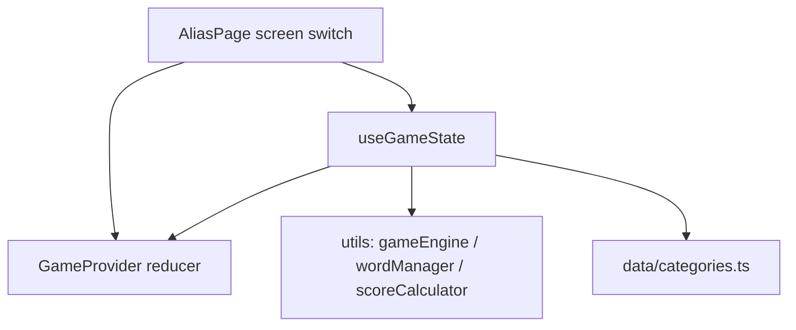

# Alias Feature

> **Maintenance rule:** Any change to feature functionality — new files, removed files, changed data shapes, screen flow, scoring, persistence, or behavioural changes — must be reflected in this file before the task is considered done.

Applies to `webApp/src/features/Alias/**`.

Pass-the-phone word explanation game: one describer sees a word, others guess out loud, then the device is passed. No backend, no Firestore, no AI.

**Do not confuse with the AI Alias role-play** (`rolePlayId=alias-game`). That product lives in RolePlay + Conversation (see [Related: AI Alias](#related-ai-alias-role-play)). Call-mode / word-list work belongs there, not in this folder.

## Entry

This folder has **no webApp App Router mount**. `AliasPage` is only composed here.

Landing hosts a parallel copy at `landing/src/features/Alias/` on `/alias` and `/[lang]/alias`. E2E lives in `landing/e2e/alias.spec.ts`. Changing this folder does **not** update the landing copy.

## Architecture



| Layer | Responsibility |
| --- | --- |
| **Types** | `types.ts` — `GameState`, `GameSettings`, `GameScreen`, `TurnState` |
| **State** | `context/GameContext.tsx` — reducer + `localStorage` persist |
| **API** | `hooks/useGameState.ts` — dispatch helpers and derived getters |
| **Logic** | `utils/` — word pool, next-word pick, scores |
| **UI** | `components/*` + `AliasPage` — one screen per `GameScreen` |

Components call `useGameState`; they do not dispatch reducer actions directly.

## Structure

```
Alias/
  AGENTS.md
  types.ts                 — source of truth for game shapes
  AliasPage.tsx            — GameProvider + screen router
  context/GameContext.tsx  — reducer, persist key alias-game-state-v1
  hooks/useGameState.ts    — start/end turn, recordCorrect/recordSkip, scores
  data/categories.ts       — Animals, Food, Sports, Technology, Travel, Nature, Professions, Home
  utils/
    gameEngine.ts          — buildInitialWordPool, pickNextWord, appendWordUsage
    wordManager.ts         — filter by category + simple/advanced, shuffle, getNextWord
    scoreCalculator.ts     — turn/player/team net scores
  components/              — one file per GameScreen, plus WordCard / GameControls / Timer / WordCounter / CategoryCard
```

## Screen flow

`AliasPage` switches on `state.screen`:

```
mode-selection → players-setup → language-level → category-selection → round-settings
    → turn-start → gameplay → turn-summary ⇄ scoreboard
         ↑______________|          |
    next player / next round       └→ game-end → mode-selection
```

Round complete = every player (free-for-all) or every team (teams) has a turn in the current round. After the last round, `TurnSummary` calls `endGame`. Scoreboard is a side view; **turn advancement lives only in `TurnSummary.handleNextTurn`**.

## Rules

- **Correct** → +1; **Skip** → −1. Turn net score is `correctCount - skipCount`.
- Timed turns: 30 / 60 / 90 seconds (`GamePlay` interval ends the turn at 0).
- Fixed-words turns: 5 / 10 / 15 actions (correct or skip both count); then `endTurn`.
- Skipped words may be drawn again after unused words are exhausted (`getNextWord`).
- Players: 2–20. Defaults in `initialGameSettings`: free-for-all, simple, timed 60s, 3 rounds.

## Persistence

`GameProvider` writes the full `GameState` to `localStorage` key `alias-game-state-v1` after hydration. Restore uses `RESTORE_STATE`. `RESET_GAME` / `initializeGame` return `initialGameState` (clears storage on the next persist).

## Conventions

- Add a setting: `GameSettings` + `initialGameSettings` in `types.ts`, then the setup screen and any reducer cases that copy settings.
- Add a screen: `GameScreen` union → component in `components/` → case in `AliasPage` → `setScreen(...)`.
- Add an action: `GameAction` + reducer case in `GameContext.tsx` → helper in `useGameState.ts` → unit test the reducer.
- Keep word picking and scoring in `utils/` (pure functions). Do not duplicate that logic in components.
- Keep `data-testid` hooks used by landing e2e (`mode-free-for-all`, `gameplay`, `button-correct`, `turn-summary-next`, …).
- New `useEffect` only for timers / `localStorage`. Gameplay timer in `GamePlay` is the existing exception.
- `Play Again` and `New Game` both reset to `mode-selection` today; if you split them, update this file.

## Related: AI Alias role-play

Not this folder. User describes words to the AI on Practice:

| Piece | Location |
| --- | --- |
| Scenario `id: 'alias-game'`, `gameMode: 'alias'` | `RolePlay/scenarios/alias-game.tsx` |
| Word generation (18 words, split user/AI) | `RolePlay/useRolePlay.tsx` → `generateRandomWord` |
| Word checklist UI | `Conversation/AliasGamePanel.tsx` |
| `GuessGameStat` | `Conversation/types.ts` |
| Analytics | `RolePlay/aliasAnalytics.ts` |

`AliasGamePanel` is mounted from `Messages`, so the word list appears in both record/chat (`ConversationCanvas`) and call (`CameraCanvas`). Alias starts in **call** mode (`useRolePlay` `conversationMode: 'call'`). Call-mode / word-list work belongs in Conversation.

## Validation

```bash
cd webApp && pnpm lint
cd webApp && pnpm test:unit -- src/features/Alias
```

Landing e2e (if the hosted `/alias` copy changed): `cd landing && pnpm test:e2e -- e2e/alias.spec.ts`

After new `i18n._()` strings: `cd webApp && pnpm lang`.
