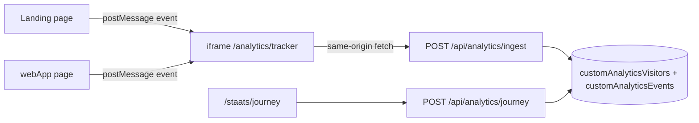

# Custom Analytics

Applies to `webApp/src/features/Analytics/Custom/**`.
Landing embed lives in `landing/src/features/Analytics/Custom/`.

## Purpose

First-party journey tracking from landing → auth / quiz / first conversation.

Goals this data should serve:

1. More active AI conversation (where people drop before speaking)
2. More subscriptions (which landing/app paths convert)

## Architecture



- Parent page never writes to Firestore.
- The iframe is hosted on `app.fluencypal.com`, so `localStorage` visitor ids are shared across `www` and `app` (same eTLD+1, iframe origin is the app).
- If no visitor id exists, the iframe creates `fpv_<uuid>` and stores it in `localStorage`.

## Core events (v1)

| Event       | When                                                 |
| ----------- | ---------------------------------------------------- |
| `page_view` | Path change on landing or webApp                     |
| `click`     | `a`, `button`, `[data-analytics]`, `[role="button"]` |
| `identify`  | Signed-in `auth.uid` becomes available               |

Each event includes path, href, title, referrer, language, screen size, source app (`landing` | `webapp`), and optional auth uid.

## Firestore

Client rules: **deny all**. Admin SDK only.

| Collection                            | Doc                                                   | Role                |
| ------------------------------------- | ----------------------------------------------------- | ------------------- |
| `customAnalyticsVisitors/{visitorId}` | Summary: last path, device, funnel flags, event count | Today / drop-off    |
| `customAnalyticsEvents/{eventId}`     | Full event timeline                                   | One visitor's route |

Funnel flags on the visitor (sticky true): `reachedLanding`, `reachedApp`, `reachedAuth`, `reachedQuiz`, `reachedPractice`.

## Admin UI

`/staats/journey` (admin email only, same `DEV_EMAILS` gate as `/staats`).

Shows users today, funnel, last path (drop-off), OS, and the full event route for a selected visitor.

## Security — keep this off the public internet

Writes

- Browser clients cannot read or write these collections (`firestore.rules` deny).
- Ingest is same-origin from the tracker iframe (`Origin` allowlist + `X-Fp-Analytics: tracker`).
- Payload is schema-clipped; unknown fields are dropped.
- Rate limits: ~4 events/sec/visitor, 180/hour/visitor, 40/10s/IP.
- Tracker page: `frame-ancestors` allowlist, `noindex`, no UI.

Reads

- `/api/analytics/journey` requires Firebase ID token and `DEV_EMAILS`.
- Do not add client Firestore listeners for these collections.
- Do not enable CORS on ingest for arbitrary origins.

Iframe

- `Content-Security-Policy: frame-ancestors` on `/analytics/tracker` allows only FluencyPal hosts + localhost.
- Parent `postMessage` is ignored unless `event.origin` is allowlisted.

## How to extract data later

1. **Admin page** — `/staats/journey` for daily ops.
2. **Admin API** — `POST /api/analytics/journey` with a Firebase bearer token (admin email). Types: `summary` (date range) and `visitor` (full timeline).
3. **Agent / analysis access** — use the Firebase Admin SDK (service account already used by webApp API). Never ship that key to the browser. A future read-only analysis endpoint can take a server secret and return aggregates, not raw dumps, if an agent should query it.
4. **Export** — query `customAnalyticsEvents` by `dayKey` and `customAnalyticsVisitors` by `lastSeenAtIso`. Optional later: scheduled export to BigQuery or a JSON dump in Storage for longer-range funnel work.
5. **Join to product data** — `authUserId` on the visitor doc links to `users/{uid}` (conversations, payments) once they sign in.

Do not grant the public Firebase client SDK access to these collections. If an agent needs data, give it a server-side admin query, not a Firestore rule exception.

## Local

Tracker URL is `http://localhost:3000/analytics/tracker`. Landing on another port still points at port 3000, so run webApp for local ingest.

## Validation

```bash
cd webApp && pnpm lint
cd webApp && pnpm test:unit -- src/features/Analytics/Custom
cd landing && pnpm lint
```
