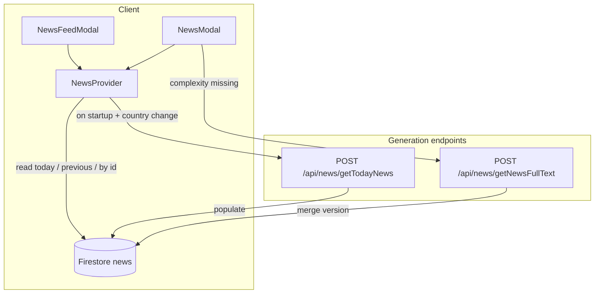

# News Feature Guide

This file applies to `webApp/src/features/News/**`.

## Structure

- `useNews.tsx` — central provider: reads Firestore, triggers background generation, manages filters and prefs.
- `newsFirestore.ts` — client-side Firestore queries for the `news` collection.
- `useNewsModal.tsx` — URL state for feed/article modals (`newsFeed=open`, `newsId`).
- `NewsFeedModal.tsx` — feed list with country, complexity, and category filters.
- `NewsModal.tsx` — single article view; loads body text on demand per complexity.
- `NewsDashboardCard.tsx` — dashboard entry point.
- `NewsPreviewCard.tsx` — row UI in the feed list.
- `NewsComments.tsx` — per-article chat thread.
- `constants.ts` — complexity labels, supported countries, gNews categories.
- `types.ts` — `NewsItem`, `NewsItemSummary`, complexity types.
- `buildNewsDiscussionPrompt.ts` — AI tutor prompt for `news-discussion` mode.
- `api/` — client-side fetch helpers (one file per endpoint): `getTodayNewsRequest.ts`, `getNewsFullTextRequest.ts`, `getNewsByIdRequest.ts`, `getPreviousDayNewsRequest.ts`.
- `backend/` — all server-side logic: cache, enrichment, gNews fetch, AI rewrites, prompts, route helpers, and request/response types. The `getTodayNews/` subfolder holds the population orchestration.

Thin Next.js route handlers live under `webApp/src/app/api/news/**` (one `route.ts` per endpoint); all real logic lives in `backend/`.

## Data Flow



1. **Startup** — `NewsProvider` reads today's items from Firestore immediately, then calls `getTodayNews`. That endpoint checks the Firestore cache; if insufficient articles exist for today it runs the full gNews ingest + enrichment (headline translation, tags, image hosting via `enrichNewsItem`) inline before responding. The response body contains the final `NewsItemSummary[]` which the client uses directly — no Firestore polling needed.
2. **Article open** — `NewsModal` loads the document from Firestore. If `versions[complexity]` is missing, it calls `getNewsFullText`, which generates one level via AI, caches it in Firestore, and returns the text.
3. **Previous days** — loaded from Firestore only (`fetchPreviousDayNewsFromFirestore`); no gNews call.

## Firestore Document Shape

Collection: `news/{id}` (deterministic id from country + language + UTC day + source URL).

Key fields:

| Field                         | Purpose                                                                   |
| ----------------------------- | ------------------------------------------------------------------------- |
| `title`, `subTitle`           | Translated headline                                                       |
| `content_origin`              | Original markdown from gNews                                              |
| `category`                    | gNews category slug (`technology`, `science`, …)                          |
| `tags`                        | Topic tags in English (AI-generated when the API provides none)           |
| `sourceImageUrl`              | Original publisher image URL (server-only; used to copy into storage)     |
| `imageUrl`                    | Public URL in our Firebase storage bucket only — never a third-party host |
| `versions`                    | Partial map of complexity → rewritten markdown (filled lazily)            |
| `dayKey`                      | UTC `YYYY-MM-DD` when the doc was populated (query key for "today")       |
| `countryCode`, `languageCode` | Region and target learning language                                       |

Security rules: signed-in users may **read** `news`; writes are server-only (Admin SDK).

## User Preferences (localStorage)

Key: `news.settings.v1`

```typescript
{
  complexity: 'beginner' | 'middle' | 'advance';
  countryOverride?: string | null;  // null = account country
  categoryFilter?: string;          // 'all' or a category slug; default 'all'
}
```

## Categories And Volume

Daily population fetches **6 categories** × **7 articles** = up to **42 items** per country/language/day (`DESIRED_COUNT` in `getTodayNews/constant.ts`).

Categories: `general`, `technology`, `science`, `business`, `sports`, `entertainment`.

The feed modal category filter is client-side over the loaded list; default is **All**.

## API Endpoints

| Endpoint                            | Role                                                                                                                                                 |
| ----------------------------------- | ---------------------------------------------------------------------------------------------------------------------------------------------------- |
| `POST /api/news/getTodayNews`       | Synchronous: returns cached articles when today's quota is met, otherwise runs full gNews ingest + enrichment inline and returns the populated list. |
| `POST /api/news/getNewsFullText`    | Generate or return cached text for one complexity level                                                                                              |
| `POST /api/news/getNewsById`        | Legacy read by id (Admin SDK); UI uses Firestore directly                                                                                            |
| `POST /api/news/getPreviousDayNews` | Legacy previous-day read; UI uses Firestore directly                                                                                                 |

## Validation

After changing files in this feature:

1. `cd webApp && pnpm lint`
2. `cd webApp && pnpm test:unit` when changing prompt builders or pure helpers.
3. News e2e: `cd webApp && pnpm test:e2e -- e2e/news/`
4. Before handoff: `cd webApp && pnpm test:e2e`

| E2e helpers: `e2e/libs/practice/news.ts` — `seedNewsItem`, `mockNewsGenerationApi`, `prepareNewsPracticePage`, `openNewsFeedModal`.

## Server-side Shared Helpers

`webApp/src/features/News/backend/newsRouteHelpers.ts` exports:

- `parseAuthenticatedJson<T>(request)` — validates auth token and parses the JSON body; throws an internal `HttpError(401)` on auth failure.
- `withRoute(handler)` — wraps a route handler; maps `HttpError` to the matching HTTP status, anything else to 500.
- `toNewsItemSummary(item)` — canonical `NewsItem → NewsItemSummary` mapper (used by all generation routes).

All `/api/news/*` route handlers must use `withRoute` + `parseAuthenticatedJson` instead of inline try/catch blocks.

## Conventions

- Prefer reading news from Firestore in the client; keep `/api/news/getTodayNews` for generation only.
- Do not call `getNewsFullText` when `versions[complexity]` is already present on the Firestore document.
- Complexity changes in the feed modal do not refetch today's list or trigger generation.
- Country override changes refetch Firestore and re-trigger generation for the new country.
- `getTodayNews` is synchronous end-to-end — do not add fire-and-forget or background scheduling inside it; Next.js terminates background work after the response is sent.
- The client (`useNews.tsx`) sets items directly from the `getTodayNews` response body; do not reintroduce Firestore polling after the API call returns.

## Keeping This File Current

When any change to `webApp/src/features/News/**` or `webApp/src/app/api/news/**` contradicts a statement in this file, update this file in the same commit/PR. Check specifically:

- Data flow steps whenever the request/response lifecycle of an endpoint changes.
- The API Endpoints table whenever an endpoint's role or behaviour changes.
- The Server-side Shared Helpers section whenever `newsRouteHelpers.ts` gains or loses exports.
- The Conventions list whenever a new architectural decision is made.
