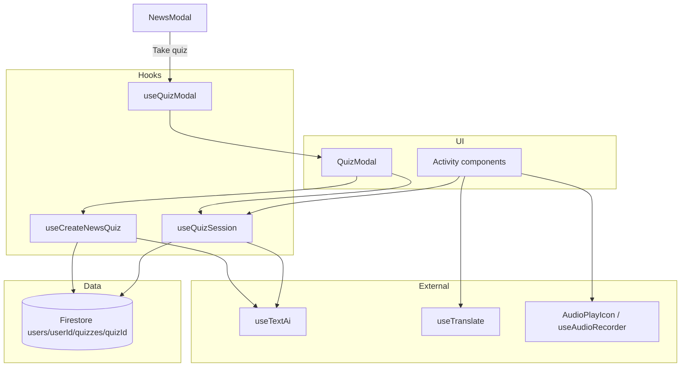

# Quiz / Exam Feature — Architecture Plan

This document describes the Quiz feature under `webApp/src/features/Quiz/`. It is the source of truth for structure, data model, and implementation phases.

**Related code today (do not confuse with this feature):**

- `webApp/src/features/Goal/Quiz/` — onboarding goal survey (`QuizSurvey2`)
- `webApp/src/features/Case/quiz/` — interview landing quizzes

---

## Goals

- Flexible quizzes: short news checks or multi-section exams lasting hours.
- Multiple activity types with shared UI patterns (modal shell, back navigation, section title).
- AI-generated content and AI evaluation via `useTextAi`.
- Client-only persistence in Firestore (`react-firebase-hooks/firestore`); no new API routes.
- Resumable progress: every answer/navigation change is persisted; reload restores state.
- MVP source: news article the user just read (`NewsModal`).
- Standalone feature — not tied to daily tasks.

---

## Product Decisions (locked)

| Topic | Decision |
| --- | --- |
| **News quiz size** | **3 questions per activity type**, grouped in one section per type. Skipped types reduce total count (see below). |
| **Activity types in MVP** | All five: `word-translation`, `fill-gap`, `read-and-answer`, `listening`, `describe-picture-voice`. |
| **Complexity switch** | New quiz per complexity (`news_{id}_{complexity}_{lang}`). Switching back restores saved progress for that complexity. |
| **Re-attempt** | **Restart** on results screen resets progress to initial state (same quiz definition kept). |
| **Multiple choice** | Single-select only. Score locally on submit → show **Correct** / **Incorrect**. Wrong answers get a **Why** button → AI explains (lazy, on demand). |
| **Evaluation timing** | Per question on submit (fast feedback). Exam summary scored locally; optional AI deep-dive on demand. |
| **Pass / fail** | Use `passingScorePercent` on the quiz document. Results screen shows pass/fail + **Get detailed feedback** (AI, on demand). |
| **Quiz entry** | **Take quiz** visible as soon as article content is loaded (no 30s read threshold). |
| **Back on Q1** | Close quiz modal only; `newsId` stays in URL so user returns to `NewsModal`. |
| **Listening** | `audioText` always visible alongside Play button. |
| **Fill-gap** | User can change gap selections any time before submitting the question. |
| **Describe picture** | Use news `imageUrl` when available; if missing, **omit** that section (3 questions skipped). |
| **Voice transcription** | `useAudioRecorder` — records audio and transcribes via existing `sendTranscriptRequest` (no new backend routes). |
| **Daily tasks** | No integration. |
| **Access** | All signed-in users. |
| **Firestore shape** | Single document (`quiz` + `progress`). 1 MB limit is sufficient. |
| **AI generation cache** | Off for now (easier debugging); add later. |
| **URL state** | `useUrlState('quizId', '', false)` from day one via `useQuizModal`. |
| **Creator input** | No explicit `goal`; optional `additionalQuizContext` string instead. |

### News quiz section matrix

| Section (type) | Included when | Questions |
| --- | --- | --- |
| Vocabulary (`word-translation`) | `nativeLanguageCode !== targetLanguageCode` | 3 |
| Grammar (`fill-gap`) | always | 3 |
| Reading (`read-and-answer`) | always | 3 |
| Listening (`listening`) | always | 3 |
| Speaking (`describe-picture-voice`) | `imageUrl` present on news item | 3 |

Typical news quiz: **9–15 questions** (3–5 sections × 3 questions).

---

## Module Overview



| Module | Responsibility | Primary export |
| --- | --- | --- |
| **Quiz definition** | Sections, questions, correct answers, evaluation instructions | `QuizDocument` in `types.ts` |
| **Progress state** | Position, answers, per-question and exam results | `QuizProgress` in `types.ts` |
| **Quiz creator** | Build `QuizDocument` from news inputs | `useCreateNewsQuiz` |
| **Session sync** | Load quiz + progress, navigation, persist mutations | `useQuizSession` |
| **Modal URL state** | Open/close quiz via `quizId` query param | `useQuizModal` |

Naming: **`useQuizSession`** is the sync hook the UI consumes. **`useQuizModal`** mirrors `useNewsModal` (`newsId` + `quizId` can coexist).

---

## URL State (`useQuizModal`)

```typescript
// useQuizModal.tsx — same pattern as useNewsModal
const [quizId, setQuizId] = useUrlState<string>('quizId', '', false);
```

| Param | Meaning |
| --- | --- |
| `quizId` empty | Quiz modal closed |
| `quizId={id}` | Quiz modal open for that document |

**Open from News:** set `quizId` to `buildNewsQuizId(newsId, complexity, languageCode)` while `newsId` remains set.

**Close quiz:** `setQuizId('')` only — user lands back on the open `NewsModal`.

**Reload:** `quizId` in URL + Firestore progress restores exact position.

---

## Firestore Layout

**Collection:** `users/{userId}/quizzes/{quizId}`

**Document:** `UserQuizRecord`

```typescript
{
  quiz: QuizDocument;
  progress: QuizProgress;
  createdAtIso: string;
  updatedAtIso: string;
}
```

**Quiz ID (news):**

```
news_{newsId}_{complexity}_{targetLanguageCode}
```

Deterministic ID: same article + complexity reuses existing doc (including in-progress answers). Different complexity → different doc → fresh generation or prior progress for that level.

**`firebaseDb.ts` additions:**

```typescript
quizzes: (userId?: string) =>
  userId ? dataPointCollection<UserQuizRecord>(`users/${userId}/quizzes`) : null,

quiz: (userId?: string, quizId?: string) =>
  userId && quizId
    ? dataPointDoc<UserQuizRecord>(`users/${userId}/quizzes/${quizId}`)
    : null,
```

**Security rules:** signed-in user read/write own `users/{userId}/quizzes/**` (add in `firestore.rules` during implementation).

---

## Activity Types (all MVP)

| Type | Component notes |
| --- | --- |
| `word-translation` | Prompt + single-select options; direction from question |
| `fill-gap` | Click gap → picker; editable until submit |
| `read-and-answer` | Passage + single-select question |
| `listening` | `audioText` visible + `AudioPlayIcon` Play button + single-select question |
| `describe-picture-voice` | News image + `useAudioRecorder` + `RecordUserAudioAnswer`; AI evaluate on submit |

All multiple-choice activities: **single-select only** (no `multipleSelection` flag).

---

## UI Shell (`QuizModal`)

Stacked over `NewsModal` (both modals can be mounted; quiz renders on top when `quizId` is set).

| Area | Behavior |
| --- | --- |
| Top left | **Back:** previous question; on first question → `useQuizModal().closeQuiz()` |
| Top center | Current section title (`Vocabulary`, `Reading`, `Listening`, …) |
| Body | Activity component for `currentQuestion.type` |
| Footer | Submit → feedback → Next |

### Per-question feedback (after submit)

1. **Correct:** show “Correct” label; optional Next.
2. **Incorrect:** show “Incorrect” + **Why** button.
3. **Why (lazy AI):** `useQuizSession().explainAnswer(questionId)` → markdown explanation (correct answer + why user's choice was wrong). Cached in `questionResults[].whyExplanation` after first fetch.

### Exam results screen (after last question)

- Local score + `passed` from `passingScorePercent`.
- **Restart** → `resetProgress()` (wipe answers/results, index → 0, status → `not-started`; keep `quiz` definition).
- **Get detailed feedback** → `requestDetailedFeedback()` (AI markdown from all answers + `examEvaluation.instruction`). Stored in `examResult.detailedFeedbackMarkdown`.

Reuse `CustomModal`. Avoid `useEffect` / `useCallback` in new Quiz code.

---

## Quiz Creator — News (`useCreateNewsQuiz`)

**Input:**

```typescript
{
  newsId: string;
  title: string;
  content: string;
  complexity: NewsLanguageComplexity;
  targetLanguageCode: SupportedLanguage;
  nativeLanguageCode: NativeLangCode | null;
  imageUrl: string | null;
  additionalQuizContext?: string;
}
```

**Flow:**

1. Compute deterministic `quizId`.
2. `getDoc` — if `UserQuizRecord` exists, return it (no re-generation).
3. Build prompt: news content + complexity + languages + which sections to include + “3 questions per section” + JSON schema.
4. `useTextAi().generateStrictJson` (**`cache: false`**).
5. Post-process: stable ids, filter out `describe-picture-voice` if no image, filter `word-translation` if native === target.
6. `setDoc` new record with `createInitialQuizProgress(quizId)`.

**Unit tests:** `buildNewsQuizId`, `buildNewsQuizPrompt`, `normalizeQuizDocument`, section inclusion rules.

---

## Session Sync (`useQuizSession`)

**Input:** `quizId: string | null` (from `useQuizModal`)

**Reads:** `useDocumentData(db.documents.quiz(userId, quizId))`

**Exposes:**

| Field / method | Purpose |
| --- | --- |
| `record` / `quiz` / `progress` | Loaded Firestore data |
| `currentSection` / `currentQuestion` | Derived indices |
| `sectionTitle` | Modal header |
| `isLoading` / `error` | Firebase hook state |
| `goBack()` | Previous question or close via `useQuizModal` on first |
| `goNext()` | Advance after question is submitted |
| `setAnswer(questionId, payload)` | Persist answer (fill-gap allows edits before submit) |
| `submitQuestion(questionId)` | Local score for MC/fill-gap; AI score for voice |
| `explainAnswer(questionId)` | Lazy AI “Why” for wrong MC answers |
| `submitExam()` | Aggregate local score, set `passed`, `status: 'evaluated'` |
| `requestDetailedFeedback()` | Lazy AI exam summary |
| `resetProgress()` | Restart — reset `progress` only |

**Persistence:** `setDoc(..., { merge: true })` on `progress` (+ nested result fields) after every mutation.

### Scoring rules

| Type | On submit |
| --- | --- |
| `word-translation`, `read-and-answer`, `listening` | Compare `selectedOptionId` to `correctOptionId` |
| `fill-gap` | All gaps must match `correctOptionId` per gap (partial → `partial` status) |
| `describe-picture-voice` | AI via `evaluation.instruction` + transcription |

**Why button:** only for `incorrect` / `partial` on auto-graded types; calls AI with question, correct answer, user's answer.

---

## AI Integration

| Use case | When | API |
| --- | --- | --- |
| Generate quiz | First open (no Firestore doc) | `generateStrictJson`, no cache |
| Explain wrong answer | User clicks **Why** | `generate` (markdown) |
| Evaluate voice answer | Question submit | `generate` or `generateJson` |
| Detailed exam feedback | User clicks **Get detailed feedback** | `generate` (markdown) |

---

## Translation

- UI chrome: Lingui `i18n._()`.
- Word-translation content: authored in correct languages per `direction`.
- Optional instruction hints: `useTranslate().translateText` when native language is set.

---

## Voice / Audio

| Activity | Stack |
| --- | --- |
| Listening | `AudioPlayIcon` `type="button"` |
| Describe picture | `useAudioRecorder` + `RecordUserAudioAnswer` |

Transcription lives in `VoiceQuizAnswer.transcription`. Audio blob stays client-side unless we later add optional upload.

---

## News Integration (MVP)

**`NewsModal.tsx`:**

1. **Take quiz** button next to **Discuss with AI** — enabled when `content` is loaded.
2. `onClick` → `useQuizModal().openQuiz(buildNewsQuizId(...))`.
3. `QuizModal` mounts when `quizId` is set; triggers `useCreateNewsQuiz` if doc missing.

No daily-task completion, no analytics requirement in MVP.

---

## Folder Structure

```
webApp/src/features/Quiz/
  plan.md
  types.ts
  AGENTS.md                         # during implementation
  useQuizModal.tsx
  buildNewsQuizId.ts
  buildNewsQuizId.test.ts
  createNewsQuiz/
    buildNewsQuizPrompt.ts
    buildNewsQuizPrompt.test.ts
    normalizeQuizDocument.ts
    normalizeQuizDocument.test.ts
    resolveIncludedSections.ts
    resolveIncludedSections.test.ts
    useCreateNewsQuiz.tsx
  session/
    useQuizSession.tsx
    scoreQuestion.ts
    scoreQuestion.test.ts
    buildExplainAnswerPrompt.ts
    buildExplainAnswerPrompt.test.ts
  components/
    QuizModal.tsx
    QuizModalHeader.tsx
    QuizResultsScreen.tsx
    QuestionFeedback.tsx
    activities/
      WordTranslationActivity.tsx
      FillGapActivity.tsx
      ReadAndAnswerActivity.tsx
      ListeningActivity.tsx
      DescribePictureVoiceActivity.tsx
  index.ts
```

---

## Implementation Phases

### Phase 0 — Done

- [x] `plan.md`
- [x] `types.ts`

### Phase 1 — News MVP

1. `firebaseDb.ts` + `firestore.rules`
2. `useQuizModal`, `buildNewsQuizId`, `createNewsQuiz/*`
3. `session/*` — scoring, explain, reset, detailed feedback
4. All five activity components + `QuizModal` + results screen
5. `NewsModal` entry point
6. `pnpm lint` + `pnpm test:unit`

### Phase 2 — Later

- AI generation caching
- PDF / manual exam sources (not planned now)
- Admin stats, analytics
- Multi-hour exam UX (timers, section breaks)

---

## Testing Strategy

- Unit tests only (no Quiz e2e in MVP).
- Pure: ID builder, section resolver, prompt builder, normalizer, scorers, progress reset reducer.
- Mock `useTextAi` in hook tests.

```bash
cd webApp && pnpm lint
cd webApp && pnpm test:unit -- src/features/Quiz
```

---

## Documentation (during implementation)

- `webApp/src/features/Quiz/AGENTS.md`
- Short section in `webApp/AGENTS.md`
