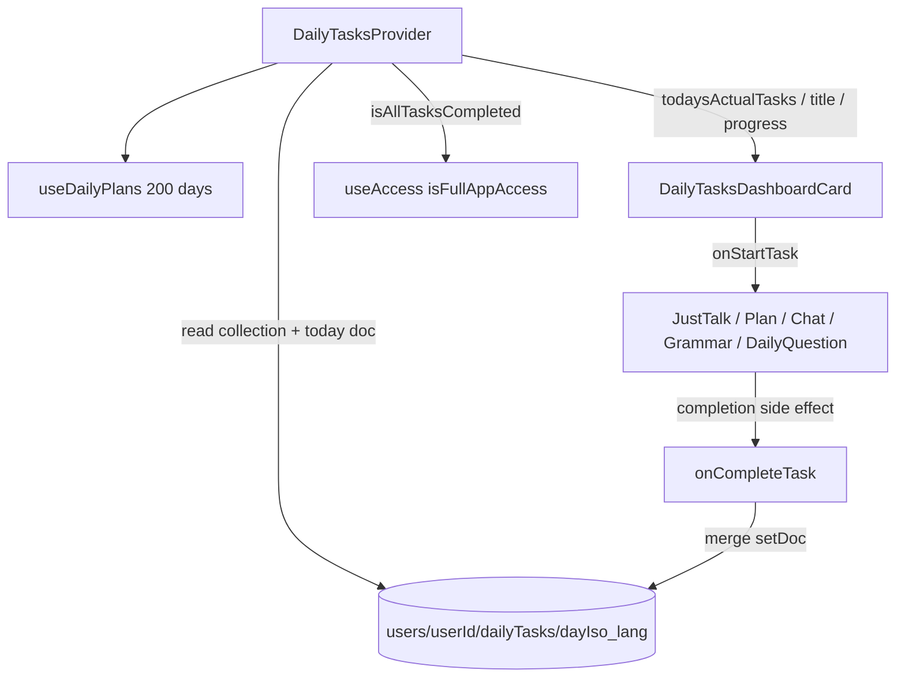

# Tasks Feature

> **Maintenance rule:** Any change to feature functionality — new files, removed files, changed data shapes, new task types, plan/cycle changes, completion wiring, auth rule changes, or behavioural changes — must be reflected in this file before the task is considered done.

Applies to `webApp/src/features/Tasks/**`. Dashboard UI, completion callers, and admin summaries live outside this folder; update this file when those contracts change.

Two independent systems share this folder:

| System | Hook | Purpose |
| --- | --- | --- |
| **Daily tasks** (current) | `useDailyTasks` | Rotating per-day plan on the dashboard; unlocks full app access when all of today’s tasks are done |
| **Legacy user tasks** | `useTasks` | Older per-day counters used by streak / progress UI (`ProgressBoard`) |

Do not mix their Firestore paths, date formats, or type unions.

## Structure

```
webApp/src/features/Tasks/
  AGENTS.md            — this file
  types.ts             — DailyTaskType, DailyTaskProgress, UserTaskType, UserTaskStats
  useDailyTasks.tsx    — DailyTasksProvider; today’s plan, progress, onCompleteTask
  useDailyPlans.ts     — 200-day plan list (early days, milestones, generated cycles)
  useTasks.tsx         — TasksProvider; legacy UserTaskStats
```

Related files outside this folder:

- `Dashboard/DailyTasksDashboardCard.tsx` — dashboard card (start handlers + icons)
- `Dashboard/dailyTasksQuotes.ts` — rotating hourly subtitle under the section header
- `Conversation/useAiConversation/useConversationStat.ts` — conversation-driven completion
- `Analytics/AdminStats/adminLearningSummary.ts` — `getDailyTasksAdminSummary`
- `Analytics/AdminStats/DailyTasksAndPlanAdmin.tsx` — admin user-card block
- `Usage/useAccess.tsx` — `isAllTasksCompleted` grants `isFullAppAccess`

## Architecture



`DailyTasksProvider` is mounted in `practiceProvider.tsx` inside `SettingsProvider` (needs `languageCode`). `TasksProvider` (legacy) is nested deeper.

## Daily tasks data model

See `types.ts`. Persisted at:

```
users/{userId}/dailyTasks/{dayIso}_{languageCode}
```

`dayIso` is UTC `YYYY-MM-DD` from `new Date().toISOString().split('T')[0]` — not local timezone.

`DailyTaskProgress`:

- `languageCode`, `dayIso`
- `tasks` — the plan snapshot written on first completion that day
- `completedTasks` — `Partial<Record<DailyTaskType, isoTimestamp>>`

A progress doc is created only when `onCompleteTask` first succeeds for that day/language. An **active day** is any previous day that has a doc (at least one task completed). The day’s plan index is:

```
countOfActiveDays = previous docs for this language with dayIso < today
dayPlan = dailyPlans[min(countOfActiveDays, 199)]
```

Plans are per learning language. Switching `settings.languageCode` uses a different doc and a different active-day count.

`onCompleteTask` is idempotent: if `completedTasks[taskType]` is already set, it returns without writing.

Owner read/write: `firestore.rules` `match /dailyTasks/{taskId}` under `users/{userId}`. Admin reads via Admin SDK in `getUserDailyTasksProgress` (`api/user/getUserInfo.ts`).

## Daily plans

`useDailyPlans` builds `DAILY_PLAN_COUNT` (200) `DayTasksMeta` entries:

1. **Days 1–49** — hand-authored `buildEarlyPlans` (onboarding copy + lighter task sets)
2. **Milestone days** (50, 60, 70, 75, 80, 90, 100, 120, 150, 180, 200) — `milestonePlan`
3. **Everything else** — `generatedPlan`: rotating `TASK_CYCLES` + templated title/subtitle

`TASK_CYCLES` excludes `news` and `story`. When `grammar-improvement` is included it is last in the list.

After day 200 the index clamps to the last plan (`Math.min(..., length - 1)`). Admin UI labels that as plan end.

`getDailyPlanTasksAtIndex(dayIndex)` is the 0-based lookup used by admin summaries (stub i18n; task IDs only). Keep it in sync with `buildDailyPlans`.

## Task types

| Type | Dashboard start | Completes when |
| --- | --- | --- |
| `just-talk` | `useJustTalk().startJustTalk` | Conversation mode `talk` reaches `CONVERSATION_DONE_MESSAGE_COUNT` (10) — `useConversationStat` |
| `goal-lesson` | Open next learning-plan element, or prompt to create a plan | Any learning-plan conversation mode (`words`, `rule`, `goal-role-play`, `goal-talk`, `grammar-improvement`) reaches 10 messages |
| `community` | `globalModals.openPublicChat` | First message in a non-`dailyQuestion` chat space — `useChat.addMessage` |
| `daily-question` | `globalModals.openDailyQuestions` | First message in a `dailyQuestion` chat — `useChat.addMessage` |
| `grammar-improvement` | `useGrammarImprovement().showAvailable` | First interactive example sentence is constructed — `GrammarImprovementModal` → `InteractiveExample.onConstructionComplete` |
| `story` | Open/rotate a story with video | **Deprecated** — still completed by `useStories.onFinishStory`; not assigned in current plans |
| `news` | no-op | **Deprecated** — still completed by `news-discussion` at 6 messages, or passing a news-sourced quiz; not assigned in current plans |

`tasksInfo` in `useDailyTasks` holds title/label for every `DailyTaskType` (including deprecated ones). Keep that record exhaustive.

## Adding a new daily task type

1. Extend `DailyTaskType` in `types.ts`.
2. Add `tasksInfo` copy in `useDailyTasks.tsx`.
3. Add the type to relevant `buildEarlyPlans` / `milestonePlan` / `TASK_CYCLES` entries in `useDailyPlans.ts`.
4. Map an icon URL and `onStartTask` handler in `DailyTasksDashboardCard.tsx` (`taskIconMap` and `tasksHandlerMap` must stay exhaustive).
5. Emit `onCompleteTask(taskType)` from the feature that detects completion. Do not complete from the dashboard card itself.
6. Update this file’s task-types table.

## Access

`useAccess.isFullAppAccess` is true when the user is a game winner, has a paid/full subscription, **or** `useDailyTasks.isAllTasksCompleted` (every task in today’s `dayPlan.tasks` has a timestamp). Completing the daily plan is a same-day unlock, not a subscription write.

## Dashboard UI

`DailyTasksDashboardCard` (home dashboard):

- Section subtitle is an hourly quote from `getHourlyDailyTasksQuote`, not `dayPlan.subTitle`.
- Card title/subtitle/badge come from the provider. When all tasks are done: title **All tasks completed**, badge **DONE**, blue background.
- Clicking the card starts the first incomplete task.
- `just-talk` shows **Loading...** while the call is starting.

## Admin

`getDailyTasksAdminSummary` prefers `todayProgress.tasks` if the user already has a doc; otherwise the generated plan for that day index. Shown on the admin user card via `DailyTasksAndPlanAdmin`.

## Legacy user tasks (`useTasks`)

Path: `users/{userId}/stats/tasks_{language}` (`UserTaskStats`).

Date keys are `DD.MM.YYYY` (dayjs), **not** ISO. `UserTaskType`: `lesson` | `words` | `rule` | `feedback` | `chat`. Values are unix timestamps.

Completion:

- Conversation length === 2: `words` / `rule` / `lesson` depending on mode
- Community message (non-dev): `chat`

Consumers: `ProgressBoard` (dashboard). `TasksCard` and `StreaksDaysBadge` exist but are not mounted. Do not extend this system for new daily-task work.

## Conventions

- Completion stays at the detecting feature. The dashboard only starts tasks.
- Avoid `useEffect` in new Tasks UI. `useConversationStat` already uses an effect to watch message count — do not duplicate that in this folder.
- `onCompleteTask` / `completeTask` must stay idempotent.
- After new `i18n._()` strings: `cd webApp && pnpm lang`.

## Validation

```bash
cd webApp && pnpm lint
```

There are no Tasks-only unit tests today. If you change `buildDailyPlans` / `getDailyPlanTasksAtIndex` / `getDailyTasksAdminSummary`, add unit tests under `src/features/Tasks` or next to `adminLearningSummary.ts` and run `cd webApp && pnpm test:unit`.

## Keeping this file current

When a change contradicts this file, update it in the same commit/PR. Check specifically:

- Task-types table whenever start or completion wiring changes
- Plan section whenever `DAILY_PLAN_COUNT`, early plans, milestones, or `TASK_CYCLES` change
- Access section if `isAllTasksCompleted` stops being a full-access path
- Structure list if files move in or out of `features/Tasks/`
